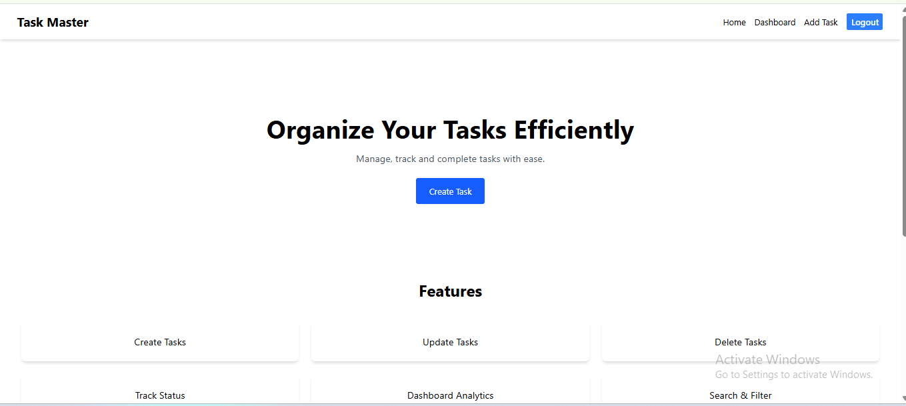
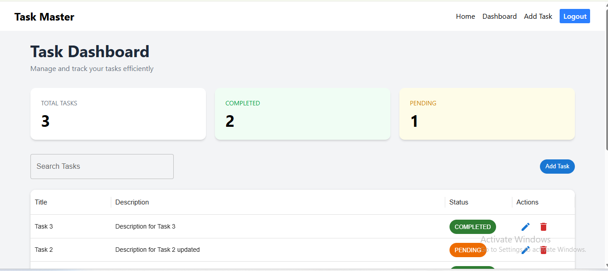
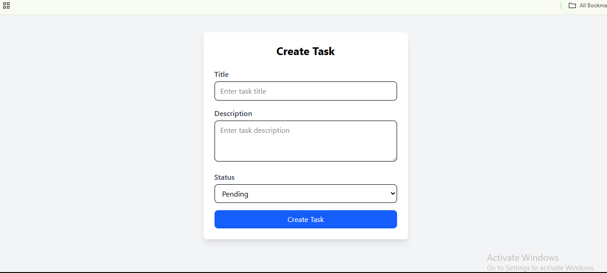
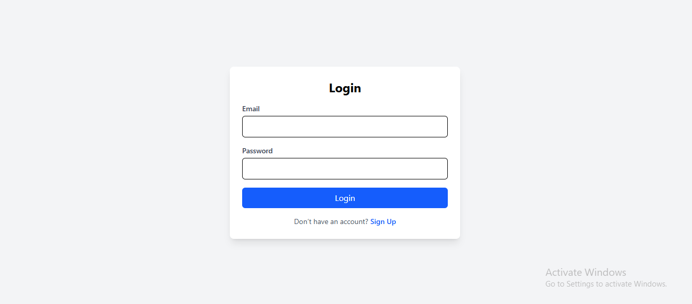
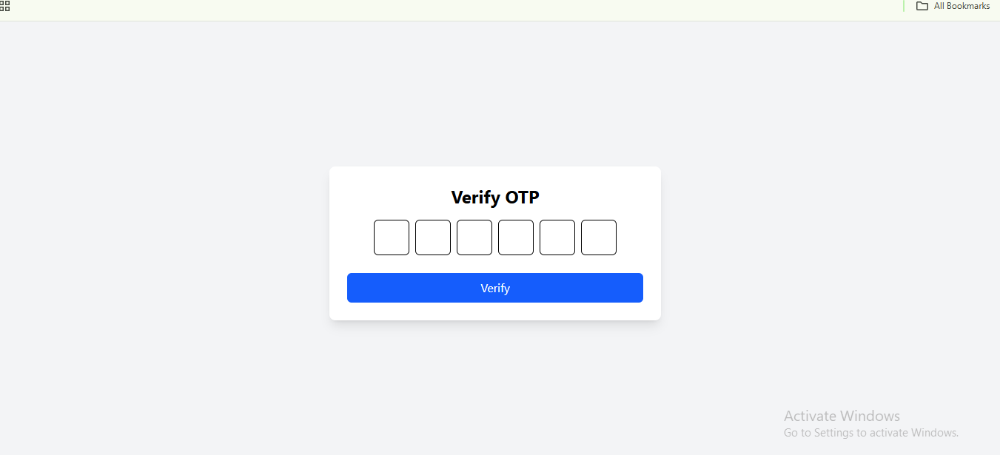

# 🚀 Task Master

A full-stack task management application built with the MERN Stack that allows users to manage their daily tasks efficiently.

## ✨ Features

- 🔐 User Authentication (Register/Login)
- 📧 OTP Verification with Nodemailer
- 📝 Create Tasks
- ✏️ Update Tasks
- 🗑️ Delete Tasks
- ✅ Toggle Task Status
- 📊 Dashboard with MUI DataGrid
- 🔍 Search Tasks
- 🛡️ Protected Routes
- 📱 Responsive Design
- 🍪 JWT Authentication
- 🔒 Helmet Security
- 🚦 Rate Limiting

---

## 🖼️ Screenshots

### Home Page



### Dashboard



### Add Task



### Login Page



### OTP Verification



> Create a folder named `screenshots` in the root directory and place your images there.

---

## 🛠️ Tech Stack

### Frontend

- React
- React Router DOM
- Axios
- Tailwind CSS
- Material UI
- Formik
- Yup
- React Hot Toast

### Backend

- Node.js
- Express.js
- MongoDB
- Mongoose
- JWT
- Bcrypt
- Nodemailer
- Helmet
- Express Rate Limit

---

## 📂 Project Structure

```text
task-master/
│
├── frontend/
│
├── backend/
│
├── screenshots/
│
└── README.md
```

---

## ⚙️ Environment Variables

### Backend `.env`

```env
PORT=8081

MONGO_URI=your_mongodb_connection_string

JWT_SECRET=your_jwt_secret

JWT_EXPIRES_IN=7d

EMAIL_USER=your_email@gmail.com

EMAIL_PASS=your_app_password
```

---

## 🚀 Installation

### 1. Clone Repository

```bash
git clone https://github.com/ravikant03/task-master.git
```

```bash
cd task-master
```

---

### 2. Install Backend Dependencies

```bash
cd backend
```

```bash
npm install
```

---

### 3. Install Frontend Dependencies

```bash
cd ../frontend
```

```bash
npm install
```

---

## ▶️ Running the Application

### Start Backend

```bash
cd backend
```

```bash
npm run dev
```

Backend runs on:

```text
http://localhost:8081
```

---

### Start Frontend

```bash
cd frontend
```

```bash
npm run dev
```

Frontend runs on:

```text
http://localhost:5173
```

---

## 🔑 Authentication Flow

```text
Fill Registration Form
        ↓
Send OTP
        ↓
Verify OTP
        ↓
Create User
        ↓
Login
        ↓
Access Protected Routes
```

---

## 📊 Dashboard Features

- View all tasks
- Search tasks by title
- Toggle task status
- Edit task
- Delete task
- Pagination using MUI DataGrid

---

## 🔒 Security Features

- Password Hashing using Bcrypt
- JWT Authentication
- Protected Routes
- Helmet Middleware
- Express Rate Limiter
- OTP Expiration using MongoDB TTL

---

## 🌐 API Endpoints

### Authentication

| Method | Endpoint                 | Description |
|----------|--------------------------|-------------|
| POST | /api/v1/auth/send-otp | Send OTP |
| POST | /api/v1/auth/verify-otp | Verify OTP |
| POST | /api/v1/auth/register | Register User |
| POST | /api/v1/auth/login | Login User |
| POST | /api/v1/auth/logout | Logout User |

### Tasks

| Method | Endpoint | Description |
|----------|----------|-------------|
| GET | /api/v1/task | Get All Tasks |
| GET | /api/v1/task/:id | Get Single Task |
| POST | /api/v1/task | Create Task |
| PATCH | /api/v1/task/:id | Update Task |
| DELETE | /api/v1/task/:id | Delete Task |
| PATCH | /api/v1/task/toggle-status/:id | Toggle Status |

---

## 🎯 Future Improvements

- Drag & Drop Tasks
- Dark Mode
- Task Categories
- Due Dates
- Email Reminders
- Team Collaboration

---

## 👨‍💻 Author

**Anuj Mishra**

MERN Stack Developer

GitHub: https://github.com/your-github-username

LinkedIn: https://linkedin.com/in/your-linkedin-profile